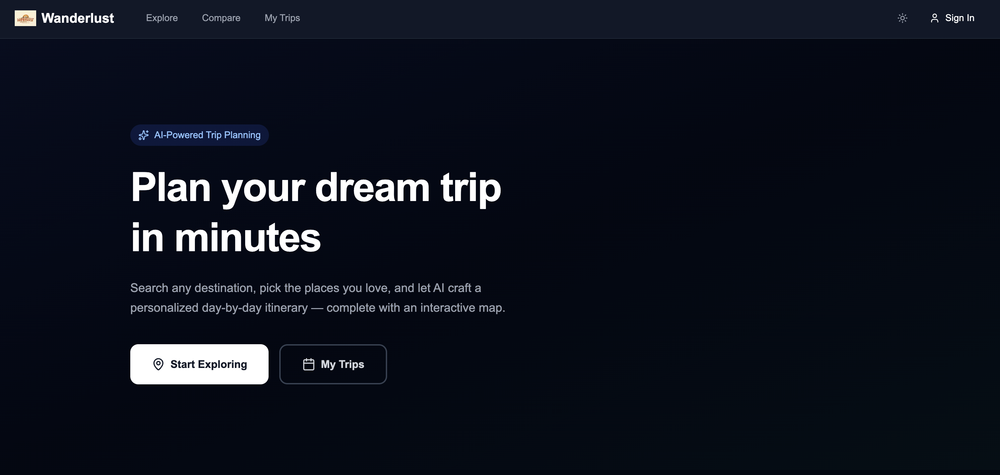
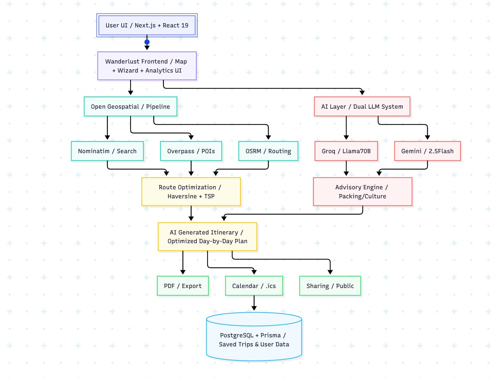
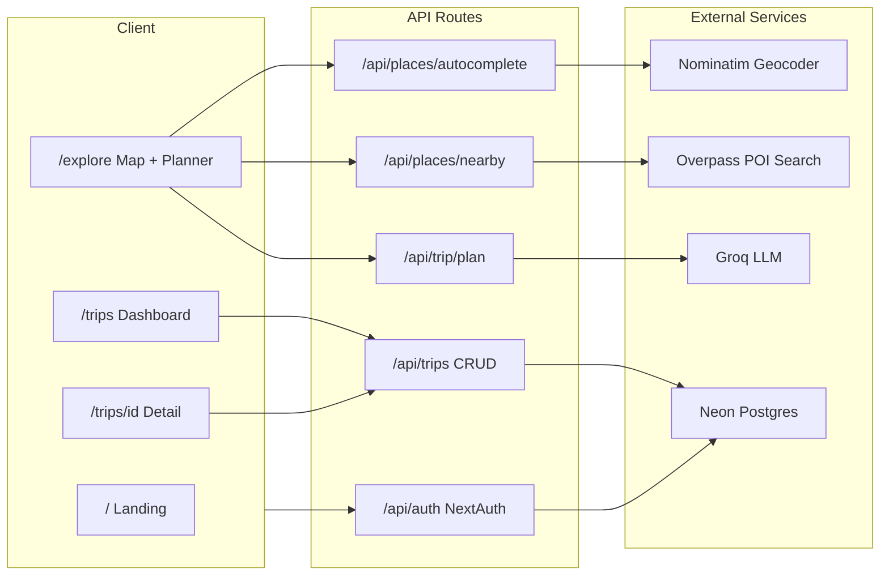

# Wanderlust — AI Travel Planner

An AI-powered travel planning app that helps you discover destinations, curate places to visit, and generate personalized day-by-day itineraries — all with an interactive map experience.



## Tech Stack

- **Framework:** Next.js 15 (App Router) + React 19 + TypeScript
- **Styling:** Tailwind CSS v4 (dark mode support)
- **Database:** PostgreSQL (Neon) + Prisma ORM
- **Auth:** NextAuth.js (Google & GitHub OAuth)
- **AI:** Groq (LLaMA 3 70B) for itinerary generation
- **Maps:** Leaflet with OpenStreetMap tiles
- **Geocoding:** Nominatim + Overpass API (OpenStreetMap)
- **Weather:** Open-Meteo (free, no API key required)
- **Animations:** Framer Motion
- **Notifications:** Sonner toast system
- **Export:** jsPDF (PDF) + ICS (calendar)
- **Validation:** Zod
- **CI:** GitHub Actions (lint, typecheck, build)

## Architecture





## Features

- **Destination Search** — Autocomplete-powered search with Nominatim geocoding
- **Interactive Map** — Full-screen Leaflet map with custom markers and fly-to navigation
- **Nearby Places** — Discover attractions, restaurants, malls, and nightlife via Overpass
- **AI Itineraries** — Groq generates structured day-by-day plans with time slots and budget awareness
- **User Auth** — Google & GitHub OAuth via NextAuth.js
- **Save & Share Trips** — Persist itineraries to Postgres, share via public URLs
- **Trip Dashboard** — View, manage, and delete saved trips
- **Weather Forecast** — Open-Meteo integration shows weather for your destination
- **PDF Export** — Download itineraries as formatted PDF documents
- **Calendar Export** — Generate .ics files to add trips to Google/Apple Calendar
- **Dark Mode** — System-aware theme toggle with manual override
- **Animated Transitions** — Framer Motion panels for smooth step-by-step flow
- **Toast Notifications** — Sonner-powered feedback for save, share, export actions
- **Loading Skeletons** — Polished loading states throughout the app
- **Dynamic OG Tags** — Public trips generate social media preview cards
- **Responsive UI** — Works on desktop and mobile
- **Security Headers** — X-Frame-Options, Referrer-Policy, Permissions-Policy
- **Zod Validation** — Schema validation on API inputs
- **Error Boundaries** — Graceful error and 404 handling
- **CI Pipeline** — Automated lint, typecheck, and build on every push

## Getting Started

### Prerequisites

- Node.js 20+
- A [Neon](https://neon.tech) Postgres database (free tier works)
- API keys for [Groq](https://console.groq.com) and [Serper](https://serper.dev) (optional)

### Setup

```bash
# Clone the repo
git clone https://github.com/yourusername/wanderlust.git
cd wanderlust

# Install dependencies
npm install

# Copy env template and fill in your values
cp .env.example .env

# Run database migrations
npx prisma migrate dev

# Start the dev server
npm run dev
```

Open [http://localhost:3000](http://localhost:3000) to see the app.

### Environment Variables

| Variable | Required | Description |
|---|---|---|
| `DATABASE_URL` | Yes | Neon Postgres connection string |
| `GROQ_API_KEY` | Yes | Groq API key for AI itineraries |
| `GROQ_MODEL` | No | Model name (default: `llama3-70b-8192`) |
| `SERPER_API_KEY` | No | Serper API for Google Places search |
| `NEXTAUTH_URL` | Yes | App URL (`http://localhost:3000` for dev) |
| `NEXTAUTH_SECRET` | Yes | `openssl rand -base64 32` |
| `GOOGLE_CLIENT_ID` | For auth | Google OAuth client ID |
| `GOOGLE_CLIENT_SECRET` | For auth | Google OAuth client secret |
| `GITHUB_ID` | For auth | GitHub OAuth app ID |
| `GITHUB_SECRET` | For auth | GitHub OAuth app secret |

### Database Commands

```bash
npm run db:migrate   # Run migrations
npm run db:push      # Push schema changes (no migration)
npm run db:studio    # Open Prisma Studio GUI
```

## Deployment

Deploy to [Vercel](https://vercel.com):

1. Push your repo to GitHub
2. Import the project in Vercel
3. Add all environment variables from `.env.example`
4. Vercel auto-detects Next.js — deploy triggers on push

The `postinstall` script automatically generates the Prisma client during deployment.

## License

MIT
